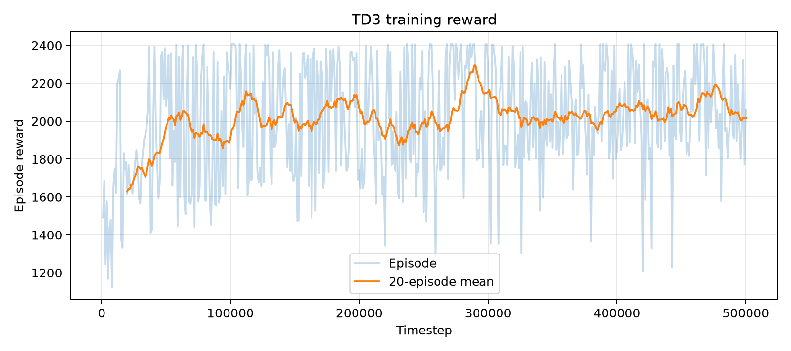
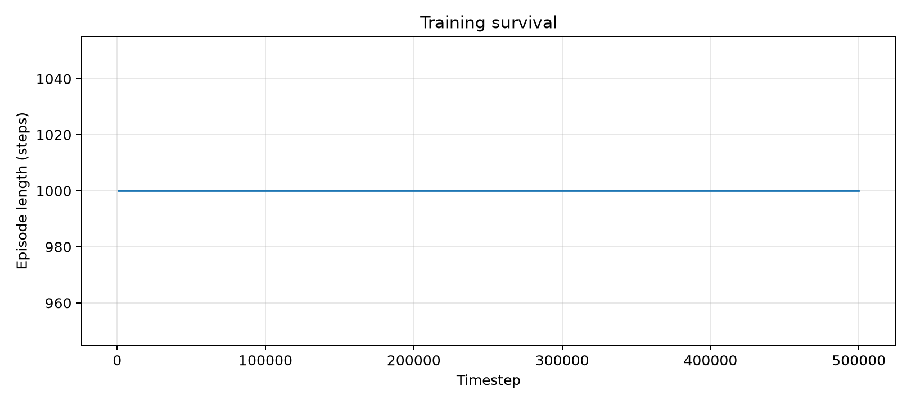
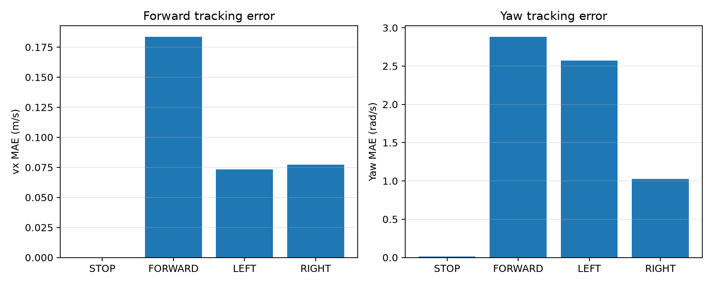
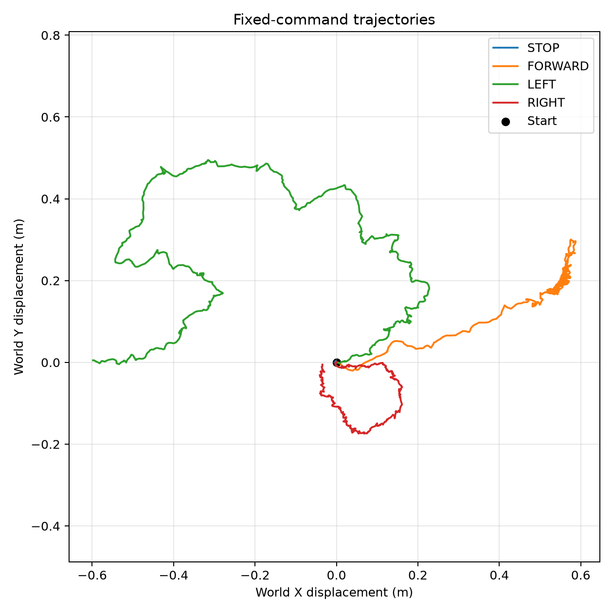
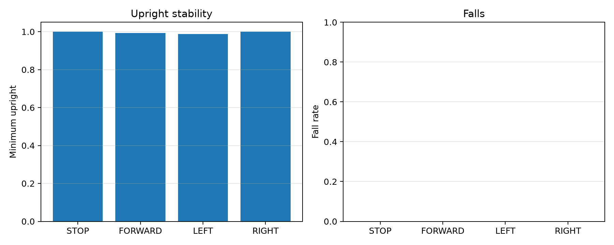
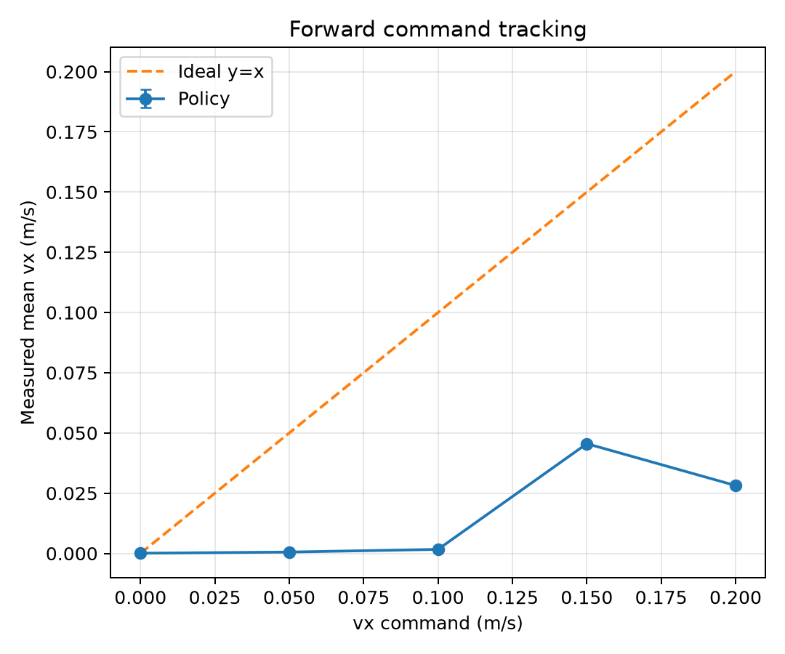
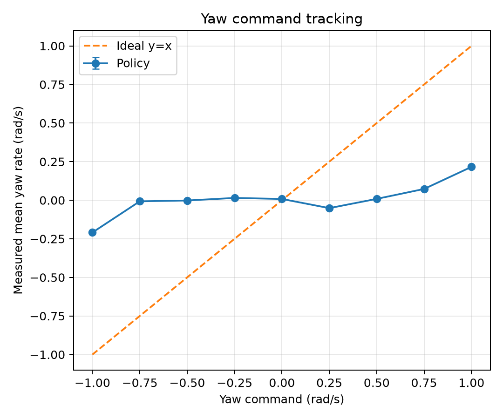

# 004 Command-Conditioned RL

## 1. Research Question
同一個 TD3 policy 能否依 continuous `[vx_cmd, yaw_cmd]` 產生可區分的 locomotion behavior？

## 2. Relationship with 003
003 比較 PPO、SAC、TD3；004 固定使用其選出的 TD3，不重新比較演算法。

## 3. Why TD3
003 TD3 完成 20 秒且未跌倒，minimum upright 0.9961、directional ratio 0.8612、path efficiency 0.9563、displacement 6.3845 m、mean forward speed 0.3250 m/s。TD3 僅被選為本實驗起點，不代表普遍最佳。

## 4. Experimental Pipeline
G1 environment → G2 500,000-step TD3 → G3 fixed commands → G4 command sweep → G5 analysis。

## 5. Environment
沿用 003 MuJoCo model、servo dynamics、20 ms control、joint limits、termination 與 safety logic；command 每 episode sampling 一次。

## 6. Observation Space
33D robot state加上 normalized `[vx_cmd/0.20, yaw_cmd/1.0]`，共 35D。

## 7. Action Space
8D continuous joint-target action，範圍 `[-1, 1]`。

## 8. Command Space
`vx_cmd ~ U(0, 0.20)` m/s、`yaw_cmd ~ U(-1, 1)` rad/s，STOP probability 0.15。

## 9. Reward Function
`r = 0.01 + 2 exp(-25(vx-vx_cmd)^2) + 0.20 exp(-(yaw-yaw_cmd)^2) - 0.50|vy| + 0.20u - 0.01 mean((a_t-a_(t-1))^2) - 10 I_fall`。

## 10. G1 Environment Validation
SB3 check、35D observation、8D action、sampling、fixed command、100-step rollout 與 finite checks：PASS。

## 11. G2 TD3 Training
完成 500,000 steps；seed 42。EvalCallback 的最佳 checkpoint 位於 310,000 steps，mean reward = 2267.21。Engineering validity：PASS。

## 12. G3 Fixed Command Evaluation
每個 command 5 episodes、每 episode 20 秒，共 20 episodes，fall count = 0。

| Command | mean vx | mean yaw | vx MAE | yaw MAE | min upright |
|---|---:|---:|---:|---:|---:|
| STOP | 0.0001 | -0.0026 | 0.0003 | 0.0137 | 0.9999 |
| FORWARD | 0.0282 | 0.1673 | 0.1835 | 2.8808 | 0.9926 |
| LEFT | 0.0971 | 0.2160 | 0.0733 | 2.5725 | 0.9874 |
| RIGHT | 0.0254 | -0.2091 | 0.0773 | 1.0241 | 0.9997 |

## 13. G4 Continuous Command Sweep
Forward sweep 5 commands、yaw sweep 9 commands，各 5 episodes，共 70 episodes。

## 14. Quantitative Results
Forward response slope = 0.2024；yaw response slope = 0.1264。Forward sweep 平均 MAE = 0.0921 m/s（零輸出 baseline = 0.1000）；yaw sweep 平均 MAE = 0.9157 rad/s（零輸出 baseline = 0.5556）。Locomotion validity：PASS。

## 15. Command Tracking Analysis
Forward conditioning：PARTIAL。整體 response 有正斜率，但 0.20 m/s response 低於 0.15 m/s，且 0.05/0.10 m/s 接近停止。Yaw conditioning：PARTIAL。±1.0 rad/s 的方向正確，但部分中間 command 符號錯誤或接近零。Command-conditioning validity：PARTIAL。

## 16. Failure Analysis
極端 commands 已產生可區分行為，但中間 command 的 magnitude response 很弱；forward 在 0.20 m/s 的反應也低於 0.15 m/s，尚非可靠的連續追蹤。 現有 forward reward 在 `vx_cmd=0.20, vx=0` 時仍為 `2e^-1 ≈ 0.736`，可能使較大 tracking error 仍取得不低 reward；本 baseline 未修改 reward。

## 17. Limitations
極端 commands 已產生可區分行為，但中間 command 的 magnitude response 很弱；forward 在 0.20 m/s 的反應也低於 0.15 m/s，尚非可靠的連續追蹤。 評估為 deterministic simulation；本實驗未涵蓋 camera、VLA、ROS2、domain randomization、sim-to-real 或 command switching。

## 18. Final Verdict
**PARTIAL PASS** — Engineering: PASS；Locomotion: PASS；Command conditioning: PARTIAL。

## 19. Next Experiment
固定 architecture 與訓練流程，只做 K_V reward-width ablation；現有 forward reward 在 vx_cmd=0.20、vx=0 時仍約為 0.736。
