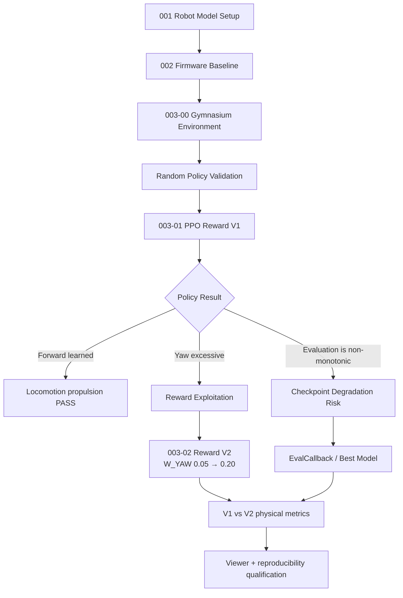
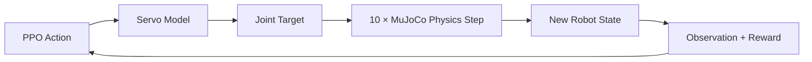
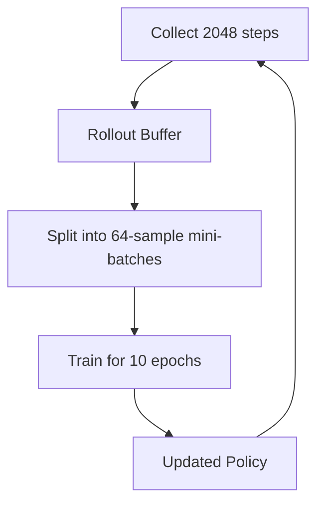
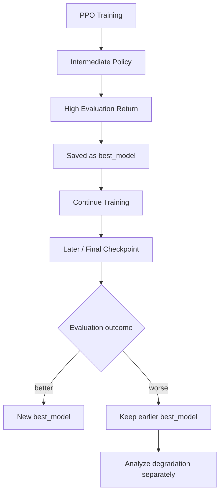

# Sesame-RL 003 Reinforcement Learning Baseline and Reward Ablation

> [!abstract] 今日研究問題
> 在固定的 Sesame MuJoCo dynamics、33D Observation 與 8D Action 下，PPO 能否學到有效的 forward propulsion？如果 Reward V1 允許「快速前進但同時高速旋轉」，把 yaw penalty 從 `0.05` 提高到 `0.20`，能否降低旋轉而保留 locomotion？



## 今日結論先讀

今天完成的工作不是單純「讓 PPO 跑起來」，而是建立了一條可檢查的 locomotion 實驗鏈：先驗證 Gymnasium environment，再用 Random Policy 建立未學習基準，接著訓練 Reward V1，診斷出 forward propulsion 與 excessive yaw 同時存在，最後完成 Reward V2 yaw ablation 與通用 model comparison。

主要結果如下：

- `003-00` 的 Observation、Action、`reset()`、`step()`、Reward、termination 與 SB3 `check_env` 均通過。Random Policy 跑滿 3 個 20 s Episode，`0/3` fall。
- MuJoCo floating-base velocity 已改成從 free-joint `qvel` 取得，並把 world-frame linear velocity 旋轉到 body frame。修正後 Random Policy 的 mean forward 為 `+0.00606 m/s`，符合「沒有學到方向」的預期。
- Reward V1 的 best policy 學到明顯 propulsion：mean forward `+0.20151 m/s`，directional ratio `0.7360`，但 mean `|yaw rate|` 高達 `127.396 deg/s`。這是「會推進，但不是穩定直走」。
- V1 evaluation return 在 `230k` timesteps 達到 `260.524`，在 `300k` evaluation 卻降到 `-101.771`。PPO training 並不保證單調改善，best checkpoint 與最後一次 evaluation 不可視為等價。
- Reward V2 已完成，不只是 Prepared。stored comparison 顯示 mean `|yaw rate|` 降至 `35.603 deg/s`，path efficiency 升至 `0.6821`；代價是 mean forward 降至 `+0.12746 m/s`。
- Reward V1 與 V2 的 reward function 不同，所以 `260.524` 與 `121.373` 不能直接當作性能高低比較。跨版本應比較 forward、lateral、yaw、trajectory、directional ratio 與 path efficiency。

| Stage | Status | Evidence state |
|---|---|---|
| `003-00` Environment baseline | **Evaluated — PASS** | CSV、terminal summary、SB3 validation 均存在 |
| `003-01` PPO Reward V1 | **Evaluated** | checkpoint、NPZ、monitor 與 detailed CSV 均存在 |
| `003-02` Reward V2 yaw ablation | **Evaluated, qualification pending** | historical results 已完成；current replay 與 stored summary 不一致 |
| Multi-seed robustness | **Pending experiment** | 尚無跨 seed results |
| Domain randomization / sim-to-real | **Not yet evaluated** | 尚未進入此階段 |

> [!warning]
> Repository 沒有保存 MuJoCo Viewer 的完整逐步 terminal log。先前人工觀察記錄為「final checkpoint 約在 step 790 減速、step 801 後 near-static；best checkpoint 持續 locomotion」，但用目前程式與現有 V2 checkpoints 重播時，best 與 final 在 episode 尾端都呈現低淨位移。因此「只有 final 在 step 801 停住」目前不能由保存資料完整重現，必須視為待重新驗證的 viewer observation。

## 實際專案結構

以下只列出今天分析直接使用的部分：

```text
sesame-RL/
├── 001-actuator mapping/
│   ├── 00_actuator_check.py
│   ├── 01_direction_check.py
│   └── 02_distal_direction_check.py
├── 002-firmware gait/
│   ├── 03_firmware_diagnostic.py
│   ├── 04_gait_symmetry_diagnostic.py
│   └── 05_per_leg_contact_phase_diagnostic.py
├── 002_firmware_gait_results/
│   ├── 03 RESULT/
│   │   ├── 03_firmware_diagnostic.csv
│   │   └── Result.md
│   ├── 04 RESULT/
│   └── 05 RESULT/
├── 003-RL/
│   ├── sesame_rl_env.py
│   ├── 00_rl_env_baseline.py
│   ├── 01_ppo_baseline.py
│   ├── 02_reward_v2_yaw_ablation.py
│   ├── 03_view_ppo.py
│   └── 04_compare_models.py
├── 003_rl_results/
│   ├── 00 RESULT/
│   │   ├── 00_random_policy_steps.csv
│   │   ├── 00_random_policy_episodes.csv
│   │   └── RESLUT.md
│   ├── 01_ppo_baseline_001/
│   │   ├── best_model/best_model.zip
│   │   ├── models/sesame_ppo_final.zip
│   │   ├── eval/evaluations.npz
│   │   ├── monitor/
│   │   ├── final_eval_steps.csv
│   │   ├── final_eval_episodes.csv
│   │   ├── config.json
│   │   └── RESULT.md
│   ├── 02_reward_v2_yaw/
│   │   ├── best_model/best_model.zip
│   │   ├── models/ppo_reward_v2_final.zip
│   │   ├── eval/evaluations.npz
│   │   ├── monitor/
│   │   └── RESULT.md
│   └── model_comparison/
│       ├── 04_summary.csv
│       ├── 04_trajectory.png
│       ├── 04_forward_velocity.png
│       ├── 04_lateral_velocity.png
│       ├── 04_yaw_rate.png
│       └── 04_metrics.png
├── assets/2026-09-23_003_rl/
│   ├── 003_random_firmware_ppo_comparison.png
│   ├── 003_best_vs_final_velocity.png
│   ├── 003_policy_trajectory.png
│   ├── 003_reward_weights.png
│   └── 003_v2_best_vs_final_replay.csv
└── 2026-09-23_003_RL_PPO_Daily_Log.md
```

## 001、002、003 在整個研究中的位置

### 001 — Actuator Mapping / Model Setup

001 建立 Sesame 的 MuJoCo robot model，確認 8 個 actuator 對應到哪一個 joint、索引順序、正負方向、joint limits 與 stand pose。Model geometry 與 actuator mapping 是後續所有控制的共同基礎；如果這裡的方向或順序錯了，後面的 firmware gait 與 learned policy 都會對錯誤的關節下命令。

### 002 — Firmware Gait Baseline

002 不使用 RL，而是把 firmware-style gait 搬入 MuJoCo：由人設計 gait sequence 與 timing，再經過 servo dynamics 驅動 8 個關節。diagnostic 另外量測 body-frame motion、per-leg contact、左右 contact duty、lateral drift 與 yaw drift。

20 s firmware diagnostic 的保存結果為：

| Metric | Firmware result |
|---|---:|
| Mean forward velocity | `-0.00226 m/s` |
| Mean absolute forward velocity | `0.04348 m/s` |
| Mean absolute lateral velocity | `0.08622 m/s` |
| Directional ratio | `0.3352` |
| Mean absolute yaw rate | `58.384 deg/s` |
| Path efficiency | `0.3086` |

因此常用的簡化描述是：Firmware directional ratio 約 `0.335`、mean `|lateral velocity|` 約 `0.086 m/s`、mean `|yaw rate|` 約 `58 deg/s`。

002 的目的不是讓 robot 完美走直線，而是建立一個「人工設計 gait」的 baseline，之後才能判斷 learned policy 到底改善了什麼，又犧牲了什麼。

### 003 — Reinforcement Learning

003 從「人直接設計每條腿怎麼動」改成「人定義狀態、控制介面與好壞標準，Policy 自己找 Action」。

```text
Robot State / Observation
          ↓
Neural Network Policy
          ↓
8D Action
          ↓
Servo model + MuJoCo physics
          ↓
Reward + next Observation
          ↓
PPO update
```

MuJoCo 負責物理模擬，Gymnasium 規定 RL environment 的介面，PPO 則使用大量 Rollout 資料更新 Policy。這種分工讓 Random、Firmware 與 PPO 的物理運動結果可以在相同指標下比較。

## 如果你是第一次接觸 RL，這個實驗到底在做什麼？

Firmware 的作法近似：

```text
人告訴 robot：
每條腿在每個 phase 應該移到哪裡。
```

PPO 的作法近似：

```text
人告訴 robot：
什麼結果比較好、什麼結果要扣分。

robot 自己尋找：
8 個 joint 應該如何隨時間動作。
```

關鍵風險是 reward 並不等於人類心中的完整目標。Reward V1 很重視 forward velocity，卻只給 yaw 很小的 penalty，因此 Policy 找到「快速推進並高速旋轉」這個高分解。這不是 PPO 犯錯，而是它精確地利用了 objective 中沒有寫清楚的部分。

## 003-00 — RL Environment Baseline

### 為什麼需要 Gymnasium environment？

在開始 PPO training 前，需要先把 Sesame MuJoCo simulation 包成標準介面，確認 Observation、Action、Reward、reset、step、termination 與 time limit 都正確。否則 training loss 即使正常下降，也可能只是在學習錯誤的速度、錯誤的座標系或錯誤的 termination。

```python
obs, info = env.reset()

obs, reward, terminated, truncated, info = env.step(action)
```

`reset()` 把 simulator 恢復到新的 Episode 起點，回傳初始 `obs` 與額外診斷 `info`。`step(action)` 接收 Policy 的 Action，推進一次 control interval，再回傳新 Observation、這一步的 Reward、是否因失敗而結束的 `terminated`、是否因時間上限而結束的 `truncated`，以及速度、姿態與 reward components 等 `info`。

| Gymnasium element | 在本專案中的意義 |
|---|---|
| `observation_space` | Policy 可收到的 33D robot state，shape 為 `(33,)` |
| `action_space` | 8 個 joint 的 normalized continuous command，shape 為 `(8,)` |
| `reward` | 每個 control step 對運動結果的數值評分 |
| `terminated` | body height 或 upright 低於門檻，代表 fall/failure |
| `truncated` | 到達 1000 control steps，即 20 s time limit |

> [!success]
> `003-00` 的 Observation validation、zero-action step、small-action sanity check 與 Stable-Baselines3 `check_env` 均為 PASS。

### Simulation parameters

| Parameter | Value | Meaning |
|---|---:|---|
| Physics dt | `0.002 s` | MuJoCo physics integration timestep |
| Control dt | `0.020 s` | RL policy/control frequency |
| Substeps | `10` | physics steps per control Action |
| Servo tau | `0.045 s` | first-order servo response time constant |
| Servo max speed | `600 deg/s` | simulated actuator speed limit |
| Action scale | `±0.580 rad` | normalized Action 到 joint target 的幅度 |
| Episode duration | `20 s` | 一個 Episode 的 nominal duration |
| Episode steps | `1000` | `20 / 0.02` |
| Action dimension | `8` | 8 個 Sesame joints |
| Observation dimension | `33` | Policy 的 robot state input |

`Physics dt = 0.002 s` 等於 500 Hz；`Control dt = 0.020 s` 等於 50 Hz。Policy 不需要以 500 Hz 推論，而是每 20 ms 給一次目標；同一個 control step 內，MuJoCo 做 10 次較小的 physics integration。



### 33D Observation

| Observation block | Dimension | 內容與用途 |
|---|---:|---|
| Joint positions | 8 | 相對 stand pose 的 joint angle，除以 `ACTION_SCALE` 正規化 |
| Joint velocities | 8 | joint angular velocity，除以 servo max speed 正規化 |
| Body-frame linear velocities | 3 | forward、lateral、vertical，單位 `m/s` |
| Body-frame angular velocities | 3 | roll、pitch、yaw rate，單位 `rad/s` |
| Projected gravity | 3 | world gravity 投影到 body frame，反映 robot orientation |
| Previous Action | 8 | 上一個 control step 的命令 |
| **Total** | **33** | `8 + 8 + 3 + 3 + 3 + 8` |

不把 absolute world X/Y 放進 Observation，是因為 locomotion Policy 應學「相對自身朝向如何前進」，而不是記住 simulator 地圖上的某個座標。body-frame velocity 讓 `forward` 始終表示 robot 自己的前方，即使 robot 已經轉向也成立。

Projected gravity 是一個不必直接使用 Euler angles 的姿態訊號。Robot 直立時，它在 body frame 中接近固定方向；robot 傾斜時，三個分量會改變。Previous Action 則讓 Policy 知道上一拍做了什麼，有助於理解控制歷史、servo 延遲與 Action 變化率。

### 8D Action

PPO 輸出：

```text
action ∈ [-1, 1]^8
```

Environment 再轉成 joint target：

```text
q_target = q_stand + action × 0.580 rad
```

單一 joint 的直觀例子：

```text
action =  0  → stand pose
action = +1  → stand + 0.580 rad
action = -1  → stand - 0.580 rad
```

實際 target 還會被 joint limits clip，避免要求 model 超過允許角度。之後 first-order servo model 以 `tau = 0.045 s` 平滑追蹤 target，並限制最大速度為 `600 deg/s`。這讓 Action 的作用較接近有延遲與速度限制的 actuator，而不是瞬間把 joint teleport 到新角度。

## MuJoCo velocity semantics bug：發現、修正與影響

早期 terminal observation 曾出現 Random Policy mean `|lateral velocity| ≈ 0.6745 m/s`、mean `|yaw rate| ≈ 2.23 deg/s`。對高度約 5 cm 的小型 robot，橫向速度接近 `0.67 m/s` 而角速度極低，和 viewer 中的劇烈擾動不相稱，因此成為 velocity semantics 錯誤的警訊。

> [!note] Evidence status
> 上述 before 數值來自今日工作說明中的 historical terminal output，但 repository 沒有保存對應 CSV/log。After 數值則可由 `00_random_policy_episodes.csv` 直接重算。

問題核心是不能把 MuJoCo 某個 6D spatial velocity buffer 的排列與 frame 意義想當然耳。Current implementation 先找出 floating-base free joint 的 `free_dof_adr`，再直接讀取：

```python
linear_world = data.qvel[adr : adr + 3]
angular_body = data.qvel[adr + 3 : adr + 6]
linear_body = rotation.T @ linear_world
```

也就是 free joint 的前三個 DoF 當作 world-frame linear velocity，後三個 DoF 當作 body-frame angular velocity；linear velocity 再用 base rotation matrix 從 world frame 轉到 body frame。若 free joint 正好從 `qvel[0]` 開始，這等價於概念上的 `qvel[0:3]` 與 `qvel[3:6]`，但程式使用 address，避免依賴 joint 必定排在 index 0。

| Metric | Before：historical terminal | After：persisted random CSV |
|---|---:|---:|
| Mean absolute lateral velocity | `≈ 0.6745 m/s` | `0.06106 m/s` |
| Mean absolute yaw rate | `≈ 2.23 deg/s` | `81.099 deg/s` |
| Mean forward velocity | 未保存 | `+0.00606 m/s` |
| Mean absolute forward velocity | 未保存 | `0.05647 m/s` |
| Mean absolute vertical velocity | 未保存 | `0.03881 m/s` |
| Mean absolute roll rate | 未保存 | `48.789 deg/s` |
| Mean absolute pitch rate | 未保存 | `38.174 deg/s` |
| Falls | 未保存 | `0/3` |

修正後的量級更符合 viewer 認知：Random Action 造成多方向抖動與很大的 roll/pitch/yaw rate，但 signed forward mean 接近零。這一修正很重要，因為 velocity 同時進入 Observation、Reward 與 evaluation metrics；若語意錯誤，PPO 會對錯誤目標進行有效最佳化。

## Random Policy 的意義

Random Policy 不是用來證明 robot 會走路，而是 smoke test：Environment 能否接收合法 Action、simulation 是否保持 finite、Reward 是否有限、robot 是否受到控制、Episode 能否依 time limit 結束。

3 個 Episode 的平均結果為：

| Metric | Random Policy |
|---|---:|
| Mean total reward | `-80.015` |
| Mean forward velocity | `+0.00606 m/s` |
| Mean absolute forward velocity | `0.05647 m/s` |
| Mean absolute lateral velocity | `0.06106 m/s` |
| Mean absolute vertical velocity | `0.03881 m/s` |
| Mean absolute yaw rate | `81.099 deg/s` |
| Falls / terminations | `0/3` |

Signed mean forward 接近零，但 absolute forward、lateral 與 yaw 都不小，表示 robot 的確在動，卻沒有穩定地把動作轉成有方向的 locomotion。

> **Motion ≠ useful locomotion.**

## PPO 是什麼？

**PPO = Proximal Policy Optimization**。它是一種 Policy Gradient 方法：利用剛收集的 Rollout，估計哪些 Action 比預期更好，再更新 Policy；`clip_range` 會限制一次更新幅度，避免新 Policy 和收集資料時的舊 Policy 差太遠。

```text
Observation
    ↓
Policy Neural Network
    ↓
Action
    ↓
Environment / MuJoCo
    ↓
Reward + next Observation
    ↓
Advantage estimate
    ↓
Policy update
```

- **Policy**：看到 Observation 後決定 8D Action 的 neural network。
- **Value function**：估計「從目前 state 開始，未來大約能拿到多少 reward」。它是 Advantage 計算的基準。
- **Rollout**：用目前 Policy 和 environment 互動，收集一段 Observation、Action、Reward 與 done flags。
- **Advantage**：某個 Action 的結果比 Value function 原先預期好多少或差多少。
- **Policy update**：讓產生正 Advantage Action 的機率提高，負 Advantage Action 的機率降低。
- **Exploration**：Policy 在 training 時保留隨機性，嘗試不同 Action；`ent_coef` 鼓勵不要過早變成單一固定行為。
- **Episode**：從 `reset()` 到 fall termination 或 20 s truncation 的一段完整互動。

### Timestep 是什麼？

本環境中：

```text
1 timestep = 1 control step = 0.02 s simulated time
```

所以：

```text
10,000 timesteps
≈ 200 s simulated interaction
≈ 10 × 20 s nominal full Episodes

300,000 timesteps
≈ 6,000 s simulated interaction
≈ 300 nominal full Episodes
```

實際 training monitor 有 301 個 training episodes；V2 其中有 episode 長度低於 1000，代表存在 early termination。Simulated time 不等於 wall-clock training time，因為 CPU/GPU inference、PPO backpropagation、logging 與 MuJoCo 計算都會消耗真實時間。

### PPO parameters

| PPO parameter | Value | 初學者解釋 |
|---|---:|---|
| `policy` | `MlpPolicy` | 用 multilayer perceptron 表示 Policy 與 Value function |
| `learning_rate` | `3e-4` | 每次參數更新的基本步幅 |
| `n_steps` | `2048` | 每次更新前先收集多少 control steps |
| `batch_size` | `64` | 每個 minibatch 使用多少 samples |
| `n_epochs` | `10` | 同一批 Rollout 資料重複訓練幾輪 |
| `gamma` | `0.99` | 未來 Reward 的折扣程度 |
| `gae_lambda` | `0.95` | Advantage estimate 的平滑與 bias/variance 折衷 |
| `clip_range` | `0.2` | 限制單次 Policy update 幅度 |
| `ent_coef` | `0.01` | 鼓勵 exploration |
| `vf_coef` | `0.50` | Value loss 在總 loss 中的權重 |
| `max_grad_norm` | `0.50` | gradient clipping 門檻 |
| `seed` | `1000` | 實驗可重現性的 random seed |
| `total_timesteps` | `300,000` | interaction budget |



## Reward V1：Policy 真正被要求最佳化的東西

Current Reward V1 weights：

```text
W_FORWARD     = 2.0
W_LATERAL     = 0.50
W_YAW         = 0.05
W_UPRIGHT     = 0.20
W_ACTION_RATE = 0.01
ALIVE_REWARD  = 0.01
FALL_PENALTY  = 10.0
```

每一步、尚未加上 fall penalty 前：

$$
r_t = 0.01
+ 2.0v_{forward}
- 0.5|v_{lateral}|
- 0.05|\omega_{yaw}|
- 0.2(1-upright)^2
- 0.01\operatorname{mean}((a_t-a_{t-1})^2)
$$

各項意義：

- `2.0 × forward velocity`：向 robot 自己的前方移動越快，Reward 越高；往後移動會變成負值。
- `0.5 × |lateral velocity|`：向左右滑動都扣分。
- `0.05 × |yaw rate|`：不論順時針或逆時針旋轉都扣分。
- `0.2 × (1-upright)^2`：偏離 upright 越多，扣分以平方增加。
- `0.01 × mean(action change²)`：抑制相鄰 Action 劇烈跳動。
- `alive reward = 0.01`：每個沒有結束的 step 有小額生存獎勵。
- `fall penalty = 10.0`：觸發 termination 時額外大幅扣分。

![[assets/2026-09-23_003_rl/003_reward_weights.png]]

**如何閱讀這張圖：** 這是 Reward coefficient 的設計比較，不是實際 rollout 中每項 reward contribution。Y 軸使用 log scale，因為 `2.0`、`0.5` 與 `0.01` 相差兩個數量級。V1 與 V2 唯一變動是 yaw coefficient 從 `0.05` 增加到 `0.20`。

## 003-01 — PPO Baseline Results

`01_ppo_baseline.py` 使用獨立 train/eval environment、`EvalCallback`、每 50k steps checkpoint 與 5 個 evaluation episodes。`config.json` 保存了 Python、PyTorch、SB3、Gymnasium、MuJoCo 版本及 PPO/Reward 設定。

V1 stored best-policy detailed evaluation：

| Metric | PPO V1 best |
|---|---:|
| Mean episode reward | `+260.524` |
| Mean forward velocity | `+0.20151 m/s` |
| Mean absolute forward velocity | `0.20818 m/s` |
| Mean absolute lateral velocity | `0.07469 m/s` |
| Directional ratio | `0.7360` |
| Mean absolute yaw rate | `127.396 deg/s` |
| Path efficiency | `0.4531` |
| Falls / terminations | `0/5` |

這裡的 `final_eval_*.csv` 檔名容易誤解。Active `01_ppo_baseline.py` 在 best model 存在時會載入 `best_model.zip` 做 detailed evaluation，因此這些 CSV 實際支持的是 **best eval model**，不是 `sesame_ppo_final.zip` 的直接 rollout。

### Random、Firmware、PPO V1、PPO V2 的物理指標

| Metric | Random | Firmware | PPO V1 best | PPO V2 best |
|---|---:|---:|---:|---:|
| Mean forward (`m/s`) | `+0.00606` | `-0.00226` | `+0.20151` | `+0.12746` |
| Mean absolute forward (`m/s`) | `0.05647` | `0.04348` | `0.20818` | `0.13555` |
| Mean absolute lateral (`m/s`) | `0.06106` | `0.08622` | `0.07469` | `0.03664` |
| Directional ratio | N/A | `0.3352` | `0.7360` | `0.7872` |
| Mean absolute yaw (`deg/s`) | `81.099` | `58.384` | `127.396` | `35.603` |
| Path efficiency | N/A | `0.3086` | `0.4531` | `0.6821` |

![[assets/2026-09-23_003_rl/003_random_firmware_ppo_comparison.png]]

**如何閱讀這張圖：** 每個 panel 都保留自己的單位，沒有把 `m/s`、`deg/s` 與 ratio 硬塞到同一 y-axis。PPO V1 的 forward 最強，卻同時有最高 yaw。PPO V2 犧牲一部分 forward，換到較低 lateral/yaw 與較高 path efficiency。Random 沒有保存 trajectory，因此 directional ratio 與 path efficiency 留為 N/A，而不是補零。

對 V1 的嚴謹結論應是：

> PPO clearly learned forward propulsion, but the stored metrics do not support a claim of stable straight locomotion.

## Reward Exploitation / Reward Misalignment

Reward V1 對 forward 的誘因比 yaw penalty 強。用 V1 best 的 mean 值做量級示意：

```text
Forward term
≈ 2.0 × 0.20
≈ +0.40 reward / step

Yaw rate
≈ 127 deg/s
≈ 2.22 rad/s

Yaw penalty
≈ 0.05 × 2.22
≈ -0.111 reward / step
```

完整 Reward 還包含 lateral、upright、Action rate 與 alive term，所以這不是每一步 Reward 的精確重建；它說明的是係數量級。高速 forward 帶來的正向收益足以容納大量 yaw，因此「fast forward + fast rotation」仍可能是高 Reward 行為。

> [!warning]
> Reward V1 produces strong forward propulsion but excessive yaw. 這是 Reward Exploitation 或 Reward Misalignment：PPO 沒有違反 objective，而是比人更徹底地最佳化了被寫進公式的 objective。

## Best Model vs Final Model

### 為什麼兩者不等價？

`best_model.zip` 是 `EvalCallback` 在固定 evaluation interval 中觀察到最高 mean evaluation return 時保存的 Policy。`final_model.zip` 則是 training loop 結束時的最後參數。PPO 的後續 update 可能改善、持平，也可能退化。



V1 `evaluations.npz` 提供了最直接的非單調證據：

| Evaluation point | Mean return | Interpretation |
|---|---:|---|
| `230,000` timesteps | `+260.524` | 全部 30 次 evaluation 中最高，保存為 best |
| `240,000` timesteps | `+241.661` | 已低於 best |
| `260,000` timesteps | `-83.942` | 明顯退化 |
| `290,000` timesteps | `+212.432` | 部分恢復 |
| `300,000` timesteps | `-101.771` | 最後一次 scheduled eval 很差 |

V2 的最高 eval return 出現在 `250,000` timesteps：`+121.373`；`300,000` evaluation 為 `+115.085`。V2 同樣不是單調改善，但末次 scheduled eval 僅略低於 best。

### Viewer observation 與 current replay

今日 viewer 人工觀察曾記下：final checkpoint 約在 step 790 開始速度下降、step 801 進入 near-static posture，而 best checkpoint 沒有在 step 801 停住。這項觀察很重要，因為它促使我們檢查 checkpoint selection；然而沒有對應的逐步 logfile 被保存。

為了檢查可重現性，本筆記使用 current `sesame_rl_env.py`、deterministic Policy、seed `2000`，對現有 V2 best/final checkpoint 各重播 1000 steps，並保存 `003_v2_best_vs_final_replay.csv`。結果為：

| Replay artifact | SHA-256 |
|---|---|
| `sesame_rl_env.py` | `e95f89cab4ff78af06957bfa131c82dd6c8d2661400614814311ee34a646b7b5` |
| V2 `best_model.zip` | `73f8a13853d3f38e87ad83081262c8ef78531b55d15d5309210b370ac1a3ed98` |
| V2 `ppo_reward_v2_final.zip` | `fdc777d6b045069593742c68949eaeb17988786c98793eaf00aa702bd19af1f2` |

| Current replay metric | V2 best | V2 final |
|---|---:|---:|
| Full-episode mean forward | `+0.02355 m/s` | `+0.03441 m/s` |
| Steps 790–999 mean forward | `+0.00090 m/s` | `+0.00321 m/s` |
| Steps 801–999 net XY displacement | `0.00211 m` | `0.00399 m` |

![[assets/2026-09-23_003_rl/003_best_vs_final_velocity.png]]

**如何閱讀這張圖：** 淡色線是每一步 instantaneous forward velocity，粗線是 31-step moving mean，垂直線標出人工觀察中的 step 790 與 801。Current replay 顯示兩個 checkpoint 約在 step 300 後都接近零平均 forward，沒有重現「best 持續走、只有 final 在 801 停下」的分離。

> [!important]
> `best_model.zip` 與 `final_model.zip` 在定義上不等價，V1 evaluation curve 也證明 training 可能退化；但特定的「final-only step-801 static behavior」目前屬於未完全重現的人工觀察。Stored V2 summary（mean forward `0.12746 m/s`）與 current replay（`0.02355 m/s`）也有顯著差異，表示歷史 runtime state、evaluation path 或 artifact provenance 尚未被完整凍結。不可偷偷把兩組結果合併。

## MuJoCo Viewer 的作用

`03_view_ppo.py` 的核心資料流是：

```text
model.predict(observation)
          ↓
env.step(action)
          ↓
mujoco.viewer render
```

數值指標無法辨識所有 locomotion failure mode。高 forward velocity 可能來自自然 gait，也可能來自滑動、持續旋轉、扭轉身體或利用不自然 contact。Viewer 可以直接檢查足端接觸、姿態、週期性、打滑與 Episode 後段是否進入 static attractor。

Viewer observation 應和逐步 CSV 一起保存。視覺檢查負責發現異常，CSV 負責量化與重現；只靠其中一種都不夠。

## 003-02 — Reward V2 Yaw Penalty Ablation

研究問題是：

> [!question]
> Can stronger yaw regularization reduce rotation without destroying forward locomotion?

中文意思是：「在維持向前推進能力的同時，更強的 yaw 正則化能不能抑制旋轉？」

這是一個 controlled ablation。唯一刻意改動為：

```text
W_YAW: 0.05 → 0.20
```

Physics、Observation、Action、servo model、PPO hyperparameters、300k timesteps、seed `1000` 與其他 reward components 都保持一致。這種設計讓結果差異較能歸因於 yaw penalty，而不是同時改了多個因素。

### 為什麼不是直接繼續 training？

如果 Reward V1 的 objective 本身容許「fast forward + fast rotation」，把 `300k` 增加到 `1M` timesteps 並不會自動教會 Policy 直走。更多 optimization 甚至可能讓這個 exploitation 更穩定。先修正 objective，再增加 computation，才是在回答正確的研究問題。

### 事前預期的三種 Case

#### Case A — Desired

```text
Forward 保持
Yaw ↓
Path efficiency ↑
```

代表 yaw regularization 有效，而且沒有摧毀推進能力。

#### Case B — Standing Still

```text
Yaw ↓↓↓
Forward → 0
```

代表 PPO 找到新的 local optimum：「不動最安全」，因為不動自然不會 yaw，也較不會 lateral drift。

#### Case C — No meaningful change

```text
Yaw still high
Forward similar
```

代表只提高 `W_YAW` 不足，需要更直接的 heading objective，例如 target heading error、朝向進度或轉向條件化命令。

### 實際 stored V2 結果：接近 Case A，但有明顯 trade-off

V2 已完成 training 與 best-model evaluation。相對 V1 stored comparison：

| Physical metric | V1 best | V2 best | Relative change |
|---|---:|---:|---:|
| Mean forward | `0.20151 m/s` | `0.12746 m/s` | `-36.75%` |
| Mean absolute forward | `0.20818 m/s` | `0.13555 m/s` | `-34.89%` |
| Mean absolute lateral | `0.07469 m/s` | `0.03664 m/s` | `-50.94%` |
| Mean absolute yaw | `127.396 deg/s` | `35.603 deg/s` | `-72.05%` |
| Directional ratio | `0.7360` | `0.7872` | `+6.96%` |
| Path efficiency | `0.4531` | `0.6821` | `+50.53%` |
| Falls | `0/5` | `0/5` | no change |

這不是無條件成功。Yaw、lateral 與 path efficiency 大幅改善，但 forward propulsion 同時下降約 37%。比較接近「yaw regularization 有效，但控制器變得較保守」。下一步應確認這個 trade-off 是否跨 seed 存在，並先解決 current replay 和 stored summary 的不一致。

> [!warning]
> V1 mean episode reward `260.524` 與 V2 `121.373` 不能直接比較。V2 對相同 yaw rate 扣四倍 penalty，Reward scale 已改變；較低 raw reward 不代表物理性能較差。

## XY trajectory：Policy 實際走過的路

![[assets/2026-09-23_003_rl/003_policy_trajectory.png]]

**如何閱讀這張圖：** 這張圖直接沿用 `04_compare_models.py` 在 historical stored comparison 中產生的 V1/V2 XY trajectory。起點在 `(0, 0)`。V1 路徑彎曲且繞行較多；V2 的路徑較直接，和 path efficiency `0.4531 → 0.6821` 的改善一致。這張圖描述的是保存的 historical rollout，不應和 current replay CSV 混成同一次 evaluation。

## 通用 model comparison / Matplotlib workflow

`04_compare_models.py` 把 checkpoint 路徑與 label 放在檔案最前面，之後對兩個 model 使用相同 `SesameRLEnv`、同一 seed、deterministic Action 與相同 1000-step rollout。它輸出：

```text
04_summary.csv
04_trajectory.png
04_forward_velocity.png
04_lateral_velocity.png
04_yaw_rate.png
04_metrics.png
```

比較流程刻意不使用 raw reward，因為不同 reward function 的尺度不相同。每次比較應優先回答：

1. Forward propulsion 是否保留？
2. Lateral motion 與 yaw 是否降低？
3. XY trajectory 是否更直接？
4. Directional ratio 與 path efficiency 是否改善？
5. 是否 fall、卡住或出現不自然 contact exploitation？

`04_metrics.png` 會把 V1 設為 100% 做 normalized comparison，避免把不同單位放在同一 y-axis；時間序列則各自保留 `m/s` 或 `deg/s`。這個工具可以擴充到 V2/V3、不同 seed 或不同 checkpoint，但使用前必須記錄 environment code version、checkpoint hash、seed 與 package versions，否則會重演本次 stored/current replay 不一致。

## 程式架構與責任分離

### `sesame_rl_env.py`

只負責共同的 Environment 邏輯：

```text
MuJoCo model loading
Observation
Action mapping
Servo dynamics
Reward
reset / step
termination / truncation
viewer hook
```

### `01_ppo_baseline.py`

負責 Reward V1 實驗：

```text
PPO training
EvalCallback
periodic checkpoint
best model selection
final model save
detailed evaluation CSV
```

### `02_reward_v2_yaw_ablation.py`

負責 Reward V2 controlled ablation，只把 `w_yaw` 設為 `0.20`，並使用獨立 eval environment 保存 best model。

### `03_view_ppo.py`

負責 visual inspection：載入 checkpoint、呼叫 `model.predict()`、推進 environment，並以 MuJoCo Viewer 即時顯示行為。

### `04_compare_models.py`

負責 generic physical comparison 與 Matplotlib export，讓兩個 checkpoint 使用同一 rollout protocol，比較 velocity、yaw、trajectory 與 summary metrics。

> Environment 與 experiment script 分開，是為了避免不同實驗不小心使用不同 physics、Observation 或 Action semantics。Ablation script 應只改研究問題指定的變因。

## What was proven today?

1. Sesame model 已可包成標準 Gymnasium RL environment。
2. 33D Observation / 8D Action pipeline 通過 SB3 validation。
3. MuJoCo floating-base velocity semantics 已在 current implementation 中改用 free-joint `qvel` 與明確的 frame transform。
4. Random Policy 建立了未學習 baseline，3 個 Episode 均無 fall，但沒有方向性 forward locomotion。
5. PPO Reward V1 能找到遠強於 Random 與 Firmware signed mean forward 的 propulsion。
6. PPO V1 directional ratio `0.7360`，高於 Firmware `0.3352`。
7. Reward V1 的 yaw penalty 不足；PPO V1 mean `|yaw| = 127.396 deg/s`，暴露 Reward Exploitation。
8. `best_model` 與 final/later Policy 在定義上不同；V1 eval return 也明顯非單調。
9. Viewer 曾觀察到 late-episode static behavior，但「final-only、step 801」的精確描述尚未由保存 log 重現。
10. `EvalCallback` 與 best checkpoint selection 對非單調 training 是必要的。
11. `W_YAW 0.05 → 0.20` 的 controlled experiment 已完成，stored results 顯示 yaw 顯著降低但 forward 也下降。
12. Generic V1/V2 comparison workflow 已能輸出 CSV 與 Matplotlib figures。

## Research Interpretation

### 已經證明

- 在目前 simulation、Observation、Action 與 Reward V1 下，PPO 能找到比 Random baseline 強得多的 forward propulsion。
- Reward V1 的 forward 與 yaw 權重配置允許高速旋轉仍取得高 return；stored best policy 明確暴露這個 misalignment。
- 更高的 yaw penalty 在 stored V2 experiment 中同時降低 yaw 與 lateral motion，並提高 directional ratio 與 path efficiency。
- Training evaluation 並非單調，不能用「最後存下來」代替 model selection。
- 只看一個 aggregate reward 不足以判定 locomotion quality，必須加入 physical metrics、trajectory 與 viewer inspection。

### 尚未證明

- 尚不能宣稱已學會穩定、自然、可重現的直線 walking。
- 尚不能證明 V2 的改善能跨 seed、跨初始狀態或跨小幅 dynamics perturbation 維持。
- 尚不能解釋 historical V2 summary 與 current replay 的差異來源。
- 尚不能把 viewer 中的 final-only step-801 static behavior 當成已重現事實。
- 尚未進行 robustness evaluation、domain randomization 或 sim-to-real。
- 尚未證明 locomotion 來自合理足端接觸，而不是 simulator-specific sliding/contact exploitation。

## FAIL、限制與資料品質紀錄

- **PASS**：003-00 API、shape、finite values、random rollout 與 SB3 validation。
- **PASS**：V1 學到 forward propulsion；這裡的 PASS 僅指 propulsion，不代表 straight walking。
- **FAIL / open issue**：V1 yaw rate 過高。
- **PASS with trade-off**：stored V2 降低 yaw/lateral 並提高 path efficiency，但 forward 降低。
- **Open reproducibility issue**：stored V2 best mean forward `0.12746 m/s`，current replay 為 `0.02355 m/s`。
- **Evidence gap**：viewer 的逐步 terminal output 未保存，無法完整還原「step 801 final-only static」敘述。
- **Protocol limitation**：多個 deterministic evaluation episodes 得到完全相同數值，表示目前 reset 沒有實質 initial-state randomization；`5 episodes` 不等於 5 個獨立情境。
- **Comparison rule**：不同 reward function 的 raw reward 不可直接比較。

## 下一步

原先規劃中的「完成 003-02 training、Viewer 檢查 V2、使用 `04_compare_models.py`、產生 trajectory/velocity/yaw plots」在 repository 中已經有產物。現在的近期優先順序應調整為：

1. 固定並記錄 exact environment commit/hash、checkpoint SHA-256、Python package versions 與 evaluation command，重跑 V2 best/final qualification。
2. 對 viewer rollout 同步保存逐步 CSV，確認 static behavior 的真正 onset、net displacement 與 Action pattern。
3. 釐清 stored V2 summary 與 current replay 為何不同；在原因確定前，不把 current replay 視為替代歷史結果。
4. 用多個真正不同的 initial conditions 與 seeds 評估 V1/V2，而不是只重複 deterministic Episode。
5. 若 V2 的 forward/yaw trade-off 可重現，再判斷是否需要 Reward V3，例如 heading error 或 command-conditioned heading objective。
6. 加入 contact/slip diagnostic，排除不自然 contact exploitation。
7. 完成 simulation robustness qualification 後，再做 domain randomization。
8. 最後才進入 sim-to-real；目前不應直接跳過 simulation policy qualification。

## Evidence index

### Current implementation

- `003-RL/sesame_rl_env.py`：Simulation、Observation、Action、Reward、velocity semantics、termination。
- `003-RL/01_ppo_baseline.py`：PPO parameters、EvalCallback、checkpoint 與 detailed evaluation routing。
- `003-RL/02_reward_v2_yaw_ablation.py`：`W_YAW = 0.20` controlled ablation。
- `003-RL/03_view_ppo.py`：MuJoCo Viewer rollout。
- `003-RL/04_compare_models.py`：同環境 model comparison 與 Matplotlib plots。

### Historical experiment artifacts

- `003_rl_results/00 RESULT/00_random_policy_steps.csv`
- `003_rl_results/00 RESULT/00_random_policy_episodes.csv`
- `003_rl_results/00 RESULT/RESLUT.md`
- `003_rl_results/01_ppo_baseline_001/config.json`
- `003_rl_results/01_ppo_baseline_001/eval/evaluations.npz`
- `003_rl_results/01_ppo_baseline_001/final_eval_steps.csv`
- `003_rl_results/01_ppo_baseline_001/final_eval_episodes.csv`
- `003_rl_results/01_ppo_baseline_001/monitor/train.monitor.csv`
- `003_rl_results/01_ppo_baseline_001/RESULT.md`
- `003_rl_results/02_reward_v2_yaw/eval/evaluations.npz`
- `003_rl_results/02_reward_v2_yaw/monitor/train.monitor.csv`
- `003_rl_results/02_reward_v2_yaw/RESULT.md`
- `003_rl_results/model_comparison/04_summary.csv`
- `003_rl_results/model_comparison/04_trajectory.png`
- `002_firmware_gait_results/03 RESULT/03_firmware_diagnostic.csv`
- `002_firmware_gait_results/03 RESULT/Result.md`

### 本筆記新增的 analysis artifacts

- `assets/2026-09-23_003_rl/003_random_firmware_ppo_comparison.png`
- `assets/2026-09-23_003_rl/003_best_vs_final_velocity.png`
- `assets/2026-09-23_003_rl/003_policy_trajectory.png`
- `assets/2026-09-23_003_rl/003_reward_weights.png`
- `assets/2026-09-23_003_rl/003_v2_best_vs_final_replay.csv`

---

這一天真正完成的研究進展，是把「PPO 會不會動」推進成更精確的問題：「它為什麼得到高分、身體實際怎麼動、哪個 checkpoint 值得比較、改 reward 後改善了什麼，又犧牲了什麼？」目前最重要的新資訊不是一個更高的 reward，而是 Reward V1 的 yaw misalignment、Reward V2 的速度/方向 trade-off，以及 evaluation provenance 必須被完整保存。
